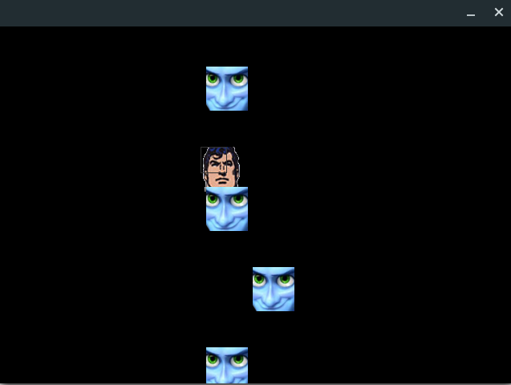
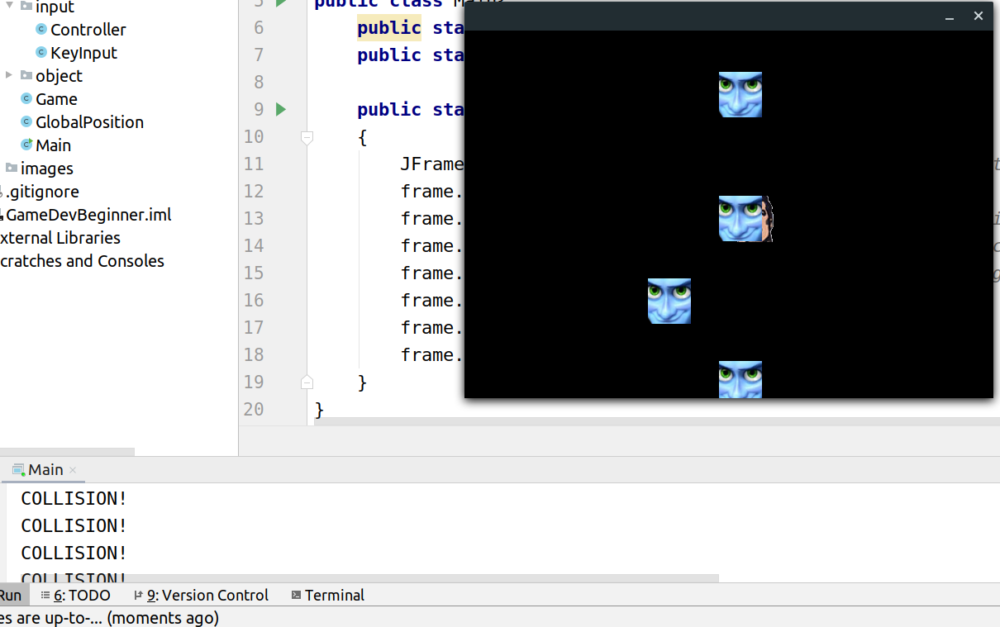

# GameDevBeginner
This is a basic game that I implemented in Java language mainly using JFrame testing my OOP fundamental concepts. This project starts off right from the base by first selecting the player image then slowly building on to adjust the background image and adding enemies and detecting collision between the player and the enemy. 

Game Started                           | Collision Encountered 
:-------------------------------------:|:-------------------------:
  |  
 

## Prerequisites
1) IDE: Use IntelliJ/Eclipse preferably
2) Java Development Kit installed on the OS

## Installing
1. JDK                                                                                                                     
Click on the link below to download the jdk from the Oracle website click on the download type based on your OS and if it is 32 bit(x86) or 64bit(x64).
You will also need to create an Oracle account following the link according to the latest rules and regulations.
https://www.oracle.com/technetwork/java/javase/downloads/jdk8-downloads-2133151.html
After downloading is complete
On Linux:
Extract the tar file by opening the terminal and type: tar -xzf "filename".tar.gz
Check the java version by typing: java --version
On Windows: Run the exe file downloaded

2. IntelliJ                                                                           
Linux: https://www.jetbrains.com/idea/download/index.html#section=linux                                               
Windows: https://www.jetbrains.com/idea/download/index.html#section=windows

 ## Running the Project
 1) Clone this project from Github and extract the zip file.
 2) Open IntelliJ and click on Open and select the location of this extracted file.
 3) Open all the java files from the left pane by clicking on Project>src>com.company
 4) Run the "main.java" program finally by clicking on the green arrow icon on the top pane
 
 ## Working of the Project
 After a window has opened after running the program,
 You can move the character along the screen by pressing the arrow keys and if it collides with the enemy, an output is shown on the console.
